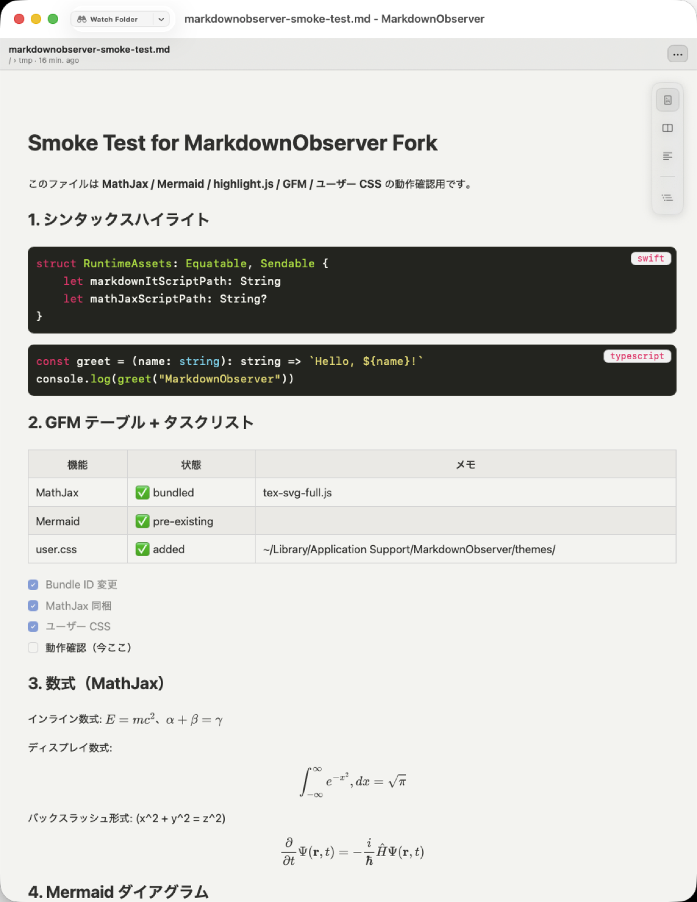

# MarkdownObserver — branch10480 personal fork

A personal fork of [larspohlmann/markdownobserver](https://github.com/larspohlmann/markdownobserver), used as a Marked 2 replacement on my own machine. Upstream is MIT-licensed.

<p align="left">
  
</p>

This README is written for **future me**: a quick reference for building, launching, and customizing this fork without digging through commit history.

## What this fork changes

| Addition | Why |
|---|---|
| **MathJax (tex-svg-full.js) bundled** | Upstream wired `MathJax.typesetPromise` but never shipped a library — math went silently unrendered. Local SVG output means no fonts, no CDN, CSP-friendly. |
| **`user.css` overlay** | Loads `~/Library/Application Support/MarkdownObserver/themes/user.css` on every render and appends it to the active theme. Lets me tweak colors / spacing without touching Swift. |
| **Fork-specific Bundle ID** | `com.github.branch10480.markdownobserver.fork` via `Config/Signing.local.xcconfig` (gitignored). Keeps LaunchServices happy alongside the App Store version. |
| **Callout + table CSS polish** | Callout body text now pins to `--reader-fg` (was muted on several themes against the tinted background). Tables always fill content width (upstream GitHub-style `display:block` left narrow tables cut short). |

Internal project name in the Xcode world is still `minimark`; the shipped product is `MarkdownObserver`.

## Requirements

- macOS 15+
- Xcode (latest stable)
- `xcode-select --install`

## Build

From the repo root:

```bash
# Resolve Swift Package dependencies (one-off after fresh clone / package bump)
xcodebuild -resolvePackageDependencies -project minimark.xcodeproj -scheme minimark

# Debug build (no signing required)
xcodebuild -project minimark.xcodeproj -scheme minimark -configuration Debug -destination 'platform=macOS' build

# Release build
xcodebuild -project minimark.xcodeproj -scheme minimark -configuration Release -destination 'platform=macOS' build
```

Signing stays off by default (via `Config/OpenSourceDefaults.xcconfig`). Bundle ID override lives in the gitignored `Config/Signing.local.xcconfig` — if that file is missing, recreate it:

```bash
cat > Config/Signing.local.xcconfig <<'EOF'
APP_BUNDLE_IDENTIFIER = com.github.branch10480.markdownobserver.fork
TESTS_BUNDLE_IDENTIFIER = $(APP_BUNDLE_IDENTIFIER).tests
UITESTS_BUNDLE_IDENTIFIER = $(APP_BUNDLE_IDENTIFIER).uitests
EOF
```

## Install to `/Applications/`

One-liner from the repo root:

```bash
./scripts/install.sh          # Release build, copied to /Applications/MarkdownObserver-Fork.app
./scripts/install.sh --alias  # also appends `alias mdo=...` to ~/.zshrc
./scripts/install.sh --debug  # Debug build instead of Release
```

The script runs `xcodebuild` with the fork-specific Bundle ID override, so no manual `Config/Signing.local.xcconfig` is required. No code signing — the binary never leaves this machine.

Set it as the default opener for `.md`:

```bash
duti -s com.github.branch10480.markdownobserver.fork md viewer  # requires `brew install duti`
```

…or just right-click a `.md` file in Finder → **Open With → Other… → MarkdownObserver-Fork → Always Open With**.

### Homebrew tap (experimental)

There is a tap at [branch10480/homebrew-tap](https://github.com/branch10480/homebrew-tap) with a `markdownobserver-fork` formula that runs the same build under `brew install --HEAD`. **On macOS 26 it currently fails** because xcodebuild's SPM resolver invokes `sandbox-exec` inside Homebrew's subprocess and the kernel rejects `sandbox_apply` with `Operation not permitted` — a known issue that needs a fix in Homebrew or Xcode. The tap is parked for when that upstream fix lands; until then, `scripts/install.sh` is the reliable path.

## Launch

```bash
# Named alias (add to ~/.zshrc)
alias mdo='open -a MarkdownObserver-Fork'

mdo path/to/file.md           # open a single file
mdo path/to/folder/           # open folder-watch mode on a directory
```

Live reload is automatic — save the markdown file in any editor and the preview updates within a second via FSEvents.

## Customize with `user.css`

All reader themes expose CSS custom properties on `:root`. Override them in `~/Library/Application Support/MarkdownObserver/themes/user.css`:

```bash
open ~/Library/Application\ Support/MarkdownObserver/themes/
# README.md there enumerates every --reader-* variable;
# user.css.example is a starter you can rename to user.css.
```

Current personal palette in use (paper-ish warm):

```css
:root {
  --reader-fg: #373734;
  --reader-bg: #F5F5F2;
}

/* Scope code-bg override to tables + definition lists so <pre> stays on the theme's syntax background. */
.markdown-body thead th,
.markdown-body tbody tr:nth-child(even) td,
.markdown-body dl {
  background: #EDECE8;
}
```

Reload: the CSS file is re-read on the next markdown render, so **save / re-open the `.md` file** (or hop to another file and back) to pick up edits. True CSS hot-reload isn't wired yet.

## Sync with upstream

```bash
# one-off: register upstream if not already
git remote add upstream ssh://git@github.com/larspohlmann/markdownobserver.git

# pull new work from upstream's develop branch
git fetch upstream
git rebase upstream/develop   # on feature/custom-css-webview-renderer
```

Conflicts most likely land in `minimark/Support/CSSThemeGenerator.swift` (table section) and `minimark/App/Resources/callout-blocks.css`.

## Tests

```bash
xcodebuild test -project minimark.xcodeproj -scheme minimark \
  -destination 'platform=macOS' -only-testing:minimarkTests
```

Known pre-existing flakes unrelated to this fork: two `RecentWatchedFoldersStore` / `SettingsAndModels` cases that touch security-scoped bookmarks.

## Project layout (quick map)

- `minimark/Services/MarkdownRenderingService.swift` — orchestrates render; merges user.css here
- `minimark/Support/UserCustomCSSLoader.swift` — reads / scaffolds `~/Library/.../themes/`
- `minimark/Support/BundledAssets.swift` — bundle paths incl. `mathJaxScriptPath`
- `minimark/Support/CSSFactory.swift` — emits MathJax `<script>` tag when bundled
- `minimark/App/Resources/Vendor/mathjax/` — local MathJax 3 SVG bundle
- `minimark/App/Resources/callout-blocks.css` — callout styling (body-text fix lives here)
- `minimark/Support/CSSThemeGenerator.swift` — main theme CSS (table width fix lives here)
- `Config/Signing.local.xcconfig` — Bundle ID override (gitignored)

## Upstream docs

Anything not covered here — project architecture, CI, contribution flow, upstream changelog — lives in the [upstream README](https://github.com/larspohlmann/markdownobserver#readme) and sibling docs (`docs/BUILDING.md`, `CONTRIBUTING.md`).

## License

MIT, same as upstream. See [LICENSE](LICENSE).
